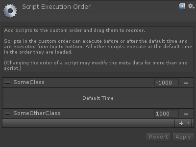

ExecutionOrderAttribute
=======================

.. highlight:: csharp

Sets a default script execution order for a MonoBehaviour.

You can also force the order, so that it can't be changed manually.

Usage
-----
Just slam the attribute on a MonoBehaviour and specify which order value it should have.
If you need it to be forced, then just set *Forced* to true.

::

    [ExecutionOrder(Order = -1000)]
    public class SomeClass : MonoBehaviour
    {
        
    }

    [ExecutionOrder(Order = 1000, Forced = true)]
    public class SomeOtherClass : MonoBehaviour
    {

    }

Results in:

