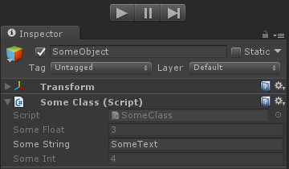
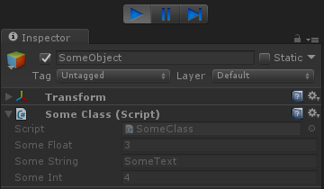

ReadOnlyAttribute
=================

.. highlight:: csharp

Makes fields marked with it uninteractable via the inspector.
You can make the field only be readonly during play mode by setting *OnlyWhilePlaying* to true.

Usage
-----
Simply sprinkle the **[ReadOnly]** attribute on a serialized field.

::

    public class SomeClass : MonoBehaviour
    {
        [ReadOnly]
        public float SomeFloat = 3;

        [ReadOnly(OnlyWhilePlaying=true)]
        public string SomeString = "SomeText";

        [SerializeField, ReadOnly]
        private int _someInt = 4;
    }

Results in:

